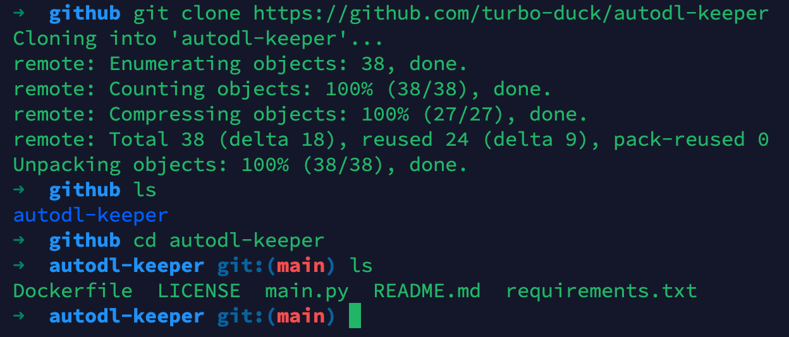
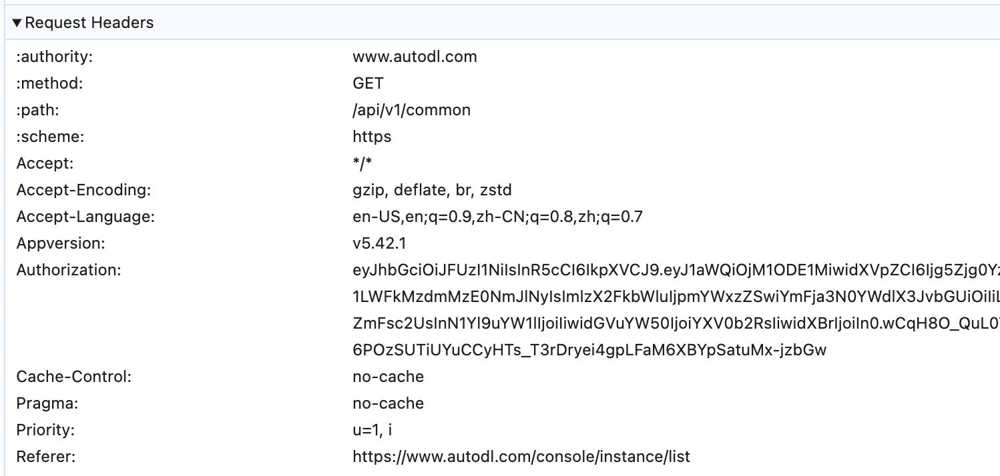
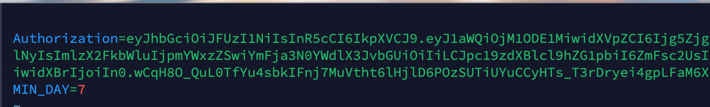
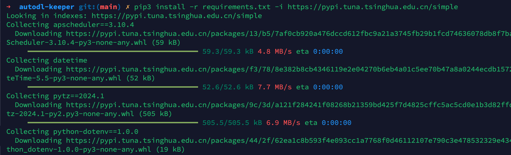
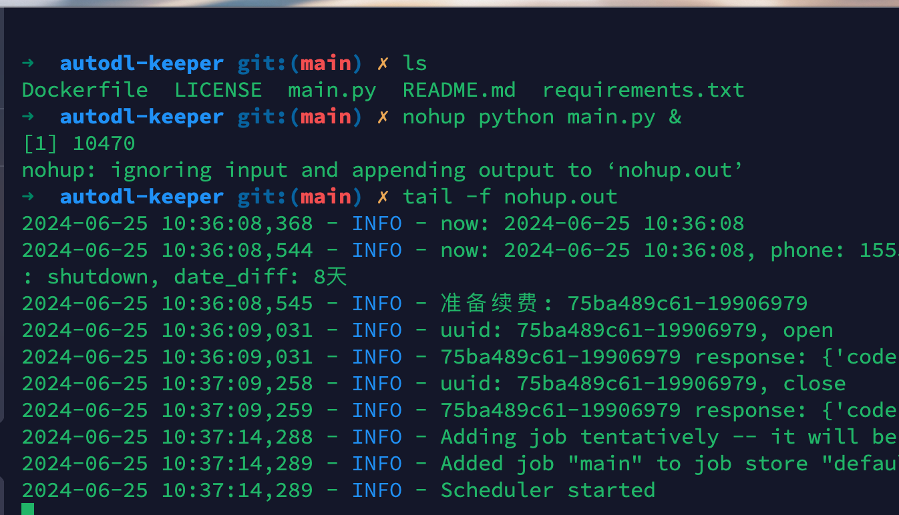
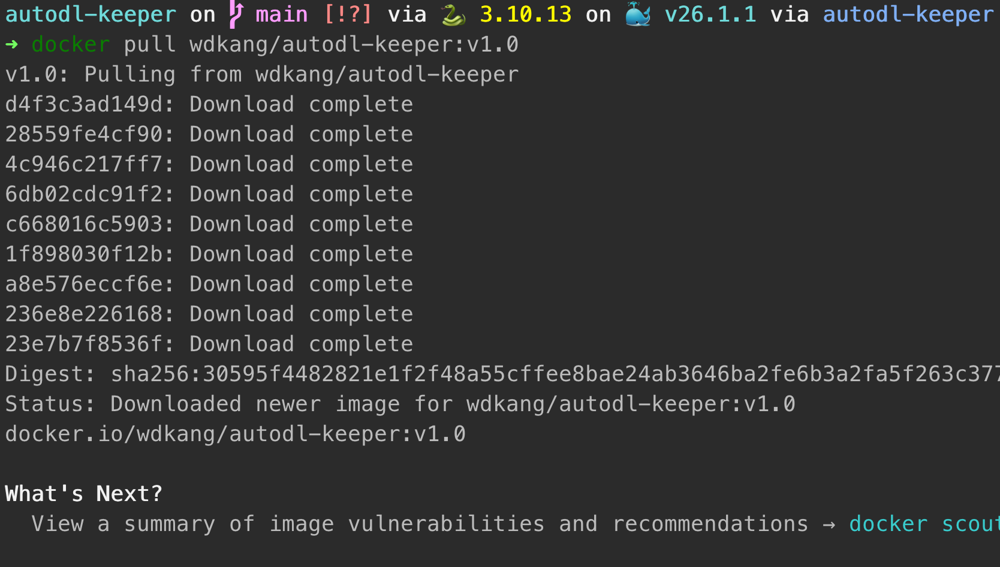
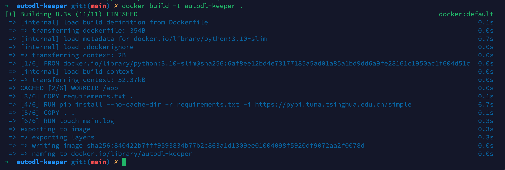

# autodl-keeper
2024-06(🚧施工中) autodl自动续签 防止实例过期释放 

# 快速开始

## 克隆项目
```shell
git clone https://github.com/turbo-duck/autodl-keeper
cd autodl-keeper
````




## 新建配置
.env.template 为模板 你可以直接复制 或者 mv 修改名字
```shell
vim .env
```

写入内容为: 
- Authorization 为你的 Cookie
- MIN_DAY 为小于这个值则进行 开机-关机 的操作

```shell
Authorization=
MIN_DAY=7
```

## 获取Authorization
(这一块后续看是否可以自动化起来)
- vim 新建 .env
- 打开你的 AutoDL网页 F12
- 刷新一下 随便找一个接口
- 找到 Request Headers 部分
- 取出 Authorization 对应的值
- 取出的值 Copy 到 .env 的Authorization
- wq 退出vim



填写结果如下



## 启动方案1: 本地启动

```shell
pip3 install -r requirements.txt -i https://pypi.tuna.tsinghua.edu.cn/simple
```
或者
```shell
pip install -r requirements.txt -i https://pypi.tuna.tsinghua.edu.cn/simple
```


启动服务
```shell
nohup python main.py &
```

## 查看日志
```shell
tail -f nohup.out
```

可以观察到，已经续费了。



## 启动方案2: 容器启动
你可以选择拉取现有镜像，或者自己打包。

**注意: 你需要查看 "新建配置" 的内容 需要配置一下 .env**

当前目录应该是这个样子:
```shell
.
├── Dockerfile
├── .env !注意这里是必须的!
├── .env.template
├── .git
├── .gitignore
├── LICENSE
├── main.py
├── nohup.out
├── README.md
└── requirements.txt
```

## 二选一: 拉取镜像
```shell
docker pull wdkang/autodl-keeper:v1.0
```


## 二选一: 打包镜像
```shell
docker build -t autodl-keeper .
```



## 启动镜像
```shell
docker run -d --env-file .env --name autodl-keeper autodl-keeper 
```
查看日志
```shell
docker logs -f autodl-keeper
```


